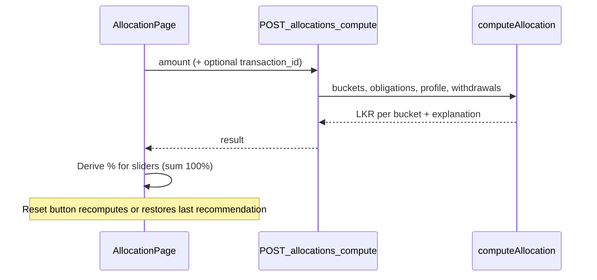

# Cash allocation: obligation-aware loading + reset

## Requirements (iteration)

- **Do not remove** the reset control; treat it as **“Reset to recommended.”**
- **On initial load**, slider values must reflect **obligations and related data** (not a fixed `DEFAULT_SPLIT`), using the same signals as the backend allocator.

## Current codebase facts

- UI today ([`src/app/(app)/allocation/page.tsx`](src/app/(app)/allocation/page.tsx)): hardcoded `DEFAULT_SPLIT`; “AI recommended split” is decorative.
- Engine today ([`src/lib/engine/allocator.ts`](src/lib/engine/allocator.ts) + [`src/app/api/allocations/compute/route.ts`](src/app/api/allocations/compute/route.ts)): uses `buckets.target_pct`, business type weights, obligation urgency, reserve health, owner salary vs withdrawals; normalizes to full incoming amount. **Not called from the allocation page.**

## Target behavior

### Initial load

1. Use the user’s incoming field default (e.g. existing `"185000"`) or empty→skip until valid `amount > 0`.
2. With auth (`session.access_token`), `POST /api/allocations/compute` with `{ amount }`.
3. Map `operations | obligations | profit_reserve | owner_salary | growth` amounts → percentage sliders:
   - `pct_k = round((proposed_k / amount) * 100)` then distribute ±1 to buckets until total is 100 (same rounding strategy as elsewhere if any).
4. Show API `explanation` in the insight strip instead of static SoleBook AI quote when available; fallback copy if error/unauthenticated demo.

### Reset to recommended

- **Must not** restore hardcoded `DEFAULT_SPLIT`.
- On click: **re-run** `POST /api/allocations/compute` with current incoming amount (fresh obligations snapshot), then re-apply derived percentages—or reset to cached “last recommendation” if you prefer fewer calls (document choice; prefer fresh recompute for accuracy).

### Obligations query tightening

- Extend compute route to only sum obligations due within the next **30 days** (and still `upcoming` / `due_soon` if those statuses are meaningful), aligning with `obligationsDueIn30Days`.

## Files to touch

- [`src/app/(app)/allocation/page.tsx`](src/app/(app)/allocation/page.tsx) — fetch compute on load + reset; map amounts ↔ sliders; keep reset button.
- [`src/app/api/allocations/compute/route.ts`](src/app/api/allocations/compute/route.ts) — obligation date filter (needs `due_date` on select).
- [`src/lib/i18n.ts`](src/lib/i18n.ts) — only if reset label should read “Reset to recommended” in both locales.

## Out of scope unless requested

- Persisting user-adjusted sliders beyond session.
- Changing allocator mathematics beyond date-filter fix (deeper rules stay a follow-up).
