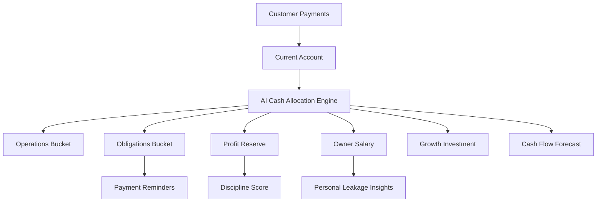

# SoleBook Implementation Plan

## Assumptions
- The current workspace appears empty, so implementation starts as a greenfield web app.
- Use Next.js + TypeScript with mock Seylan Bank/API, ERP/POS, and manual-entry data for the hackathon MVP.
- The product is a **Progressive Web App (PWA)** from day one: installable on supported mobile and desktop browsers, app-like shell (standalone display), and a deliberate offline story (at minimum cached shell + clear messaging when data cannot refresh).
- Primary users include **non-technical SME owners**; the default experience should hide integration and implementation complexity, use plain language, and expose deeper controls only when the user seeks them.
- First file to create after approval: [`SoleBook_Implementation_Plan.txt`](SoleBook_Implementation_Plan.txt), containing this implementation plan in plain text.

## Product Direction
Build SoleBook as an **AI Financial Discipline Engine for SMEs**, not as accounting software or a full ERP. The MVP should prove one clear story: SME owners receive money, SoleBook detects financial behavior, recommends cash allocation into smart buckets, warns about upcoming risks, and encourages disciplined owner salary withdrawals.

Core smart buckets:
- Operations
- Obligations
- Profit Reserve
- Owner Salary
- Growth/Investment

High-level flow:

## PWA, installation, and simplicity (cross-cutting)
These requirements apply from Phase 1 onward; they are not a late add-on.

**PWA and installation**
- Meet installability criteria for target browsers: valid manifest, required icon sizes, start URL, display mode, theme/background colors, and a registered service worker with a defined caching strategy.
- Treat “installed” SoleBook the same as in-tab: deep links, same core flows, respect safe areas on notched devices.
- Document expected behavior when offline (what still works vs what shows a simple “connect to update” message).

**Hiding complexity for new users**
- Onboarding leads with outcomes (“see your cash picture,” “get one recommendation”) not architecture (no “PWA,” “API,” “sync,” or “service worker” in default copy).
- Use **progressive disclosure**: one primary action per screen where possible; bank/ERP/manual paths as optional branches, not walls.
- Provide a single, friendly **Add to home screen / Install app** prompt when the browser allows; if install is unavailable, show a short device-specific tip once—not persistent technical debug UI.
- Settings or “advanced” area holds diagnostics, version/build info, and any future power-user toggles.

**Everything simple**
- Vocabulary: short labels, local business language where it helps, and AI insights written as sentences a non-accountant understands.
- Visual hierarchy: fewer numbers on the first dashboard view; expand detail on tap.
- Errors and empty states: always suggest the **next one thing** to do, without assuming technical literacy.

## Phase 1: Hackathon MVP
Create a polished dashboard-driven demo focused on clarity and judge impact.

Planned structure:
- [`src/app`](src/app): Next.js app routes and page shell.
- [`src/components`](src/components): dashboard cards, bucket views, insight cards, onboarding UI.
- [`src/lib/finance`](src/lib/finance): allocation engine, scoring rules, forecast logic, mock transaction categorization.
- [`src/lib/mock-data`](src/lib/mock-data): sample bank transactions, ERP summaries, obligations, owner withdrawals.
- [`src/types`](src/types): transaction, bucket, business profile, obligation, insight, and score models.

MVP screens:
- Onboarding: demo-first path, business type selection, owner salary goal, AI-generated bucket setup—worded for non-specialists; integrations optional, never blocking the first win.
- Dashboard: cash balance, smart buckets, AI recommendation card, discipline score, risk alerts.
- Cash Allocation: incoming payment simulation and recommended split with Accept/Adjust UX.
- Obligations: upcoming rent, salaries, utilities, loan payments, supplier dues, cheque dates.
- Owner Salary: recommended monthly owner compensation, withdrawal tracking, leakage warning.
- AI Insights: human-language alerts such as “Supplier payments may fail in 9 days.”

MVP logic:
- Dynamic allocation based on business type, upcoming obligations, recent cash behavior, reserve strength, and owner withdrawal pattern.
- Priority engine for obligations: high priority salaries, utilities, rent, loans; medium priority suppliers; low priority optional growth spending.
- Discipline score based on on-time payments, reserve consistency, owner salary stability, late obligations, and personal leakage.
- Simple forecast that projects cash risk over the next 7, 14, and 30 days.

## Phase 2: Production Foundation
Replace hackathon mock data with real backend boundaries and durable models.

Key additions:
- Authentication and business profiles.
- Bank transaction ingestion layer for Seylan APIs or Open Banking-style connectors.
- ERP/POS summary import layer for sales totals, purchase totals, payroll totals, supplier dues, and invoices.
- Database schema for businesses, accounts, buckets, transactions, obligations, allocations, insights, and scores.
- Event-driven allocation runs when new income arrives, large expenses happen, or deadlines approach.
- Daily AI health check for cash-flow risks.

## Phase 3: AI And Risk Intelligence
Add explainable AI without hiding core rules.

AI responsibilities:
- Categorize transaction intent and detect personal/business mixing.
- Explain allocation recommendations in plain language.
- Predict upcoming cash shortages.
- Detect unusual withdrawals, shrinking reserves, late-payment patterns, and supplier-credit risk.
- Generate bank-friendly financial discipline summaries for loan readiness.

Important guardrail:
- AI recommends first; it should not force transfers or block owner actions in the MVP.

## Phase 4: Bank And SME Ecosystem
Position SoleBook as infrastructure that banks, ERP vendors, and SME platforms can integrate.

Production integrations:
- Banking APIs for transactions and virtual pockets/buckets.
- Payment rails for QR/card settlements and bank transfers.
- ERP/POS connectors for high-level financial summaries only.
- Loan readiness reports for banks.
- Compliance-ready audit trail for recommendation history and user approvals.

## Success Criteria
The MVP is successful if judges can understand the value in under two minutes:
- Money enters one current account.
- SoleBook recommends a smarter allocation.
- Owner salary is separated from random withdrawals.
- Obligations are reserved before they become emergencies.
- The app predicts risk before cash-flow failure happens.
- The product feels like SME financial discipline infrastructure, not another expense tracker.

**PWA, install, and simplicity checks**
- On a typical phone browser, SoleBook can be **installed** (or “added to home screen”) and launches in a standalone window with correct name and icon.
- A new user can complete onboarding and reach the dashboard **without** encountering technical setup jargon.
- Offline or flaky network: the app fails gracefully with plain-language guidance, not broken blank screens.