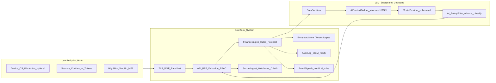

# SoleBook architecture: ingestion, AI inputs, and security

## Goals (relative to your current diagram)

Your Phase 1 diagram is *correct as a narrative* (money enters, engine allocates). What it omits—and what enterprises and banks eventually require—is **where truth comes from** (sources of record), **how it is authenticated and protected**, and **what the AI is allowed to use** versus what must remain deterministic finance logic.

This plan reframes SoleBook into **layers + trust boundaries** while preserving the core product spine from the existing direction doc.

## Canonical product spine (unchanged)

Keep the owner-facing storyline:

Customer payments and operating cash converge on a **current account view**, then **`AI Cash Allocation Engine`** proposes splits into buckets (operations, obligations, profit reserve, owner salary, growth) with ancillary outputs (reminders, discipline score, leakage insights, forecast).

See the existing MVP flow in [.cursor/plans/solebook_implementation_7bce9835.plan.md](.cursor/plans/solebook_implementation_7bce9835.plan.md).

## Reference architecture (end-to-end)

```mermaid
flowchart TB
  subgraph clients [Clients]
    pwa[PWA Nextjs]
    admin[OpsAdmin_optional]
  end

  subgraph edge [EdgeAndGateway]
    cdn[WAF_TLS_CDN]
    apigw[API_Gateway_rateLimit]
    bff[BFF_optional]
  end

  subgraph identity [IdentityAndAccess]
    idp[IdP_OIDC]
    mfa[MFA_optional]
    rbac[RBAC_OrganizationRoles]
    consent[ConsentAndScopes_bankERP]
    audit[AuditLog_immutable]
  end

  subgraph ingest [SecureIngestion]
    webhookIn[WebhookReceiver_HMAC_rotate]
    poller[ScheduledConnectors_optional]
    fileIn[BulkImport_optional]
    norm[Normalizer_Mapper_Versioned]
    idem[Idempotency_ReplaySafe]
    dlq[DeadLetter_ErrorTaxonomy]
  end

  subgraph sources [ExternalSystems]
    bank[Bank_OpenBanking_Aggregators]
    pos[POS_SalesPaymentsRefunds]
    erp[ERP_AP_AR_GL_PayrollInvoices]
  end

  subgraph store [PlatformData]
    olap[OperationalDB_postgres_mysql]
    obj[ObjectStore_statements_attachments]
    cache[Redis_rateSession_optional]
    events[EventOutbox_domainEvents]
    vector[Embeddings_optional]
  end

  subgraph aiCtx [AIContextLayer_featureStore]
    feats[FinancialFeatures_dailyRollups_counters]
    graph[KnowledgeGraph_optional_vendors_staff]
    pii[PiiMinimizer_tokenization_optional]
    evals[AIEvaluation_Datasets_RedTeaming_optional]
  end

  subgraph engine [FinanceAndAIEngine]
    rules[PolicyRules_mustPay_reserveCaps]
    fore[Forecasting_deterministic]
    alloc[RecommendationGenerator_LLM_optional]
    explain[ExplainabilityTemplates]
    human[HumanInTheLoop_approveAdjust]
  end

  subgraph outputs [Outputs]
    ui[InsightsDashboard]
    alerts[ReminderNotifications_email_push]
    export[Exports_bankReadiness_reports_optional]
  end

  pwa --> cdn --> apigw
  admin --> cdn
  apigw --> idp
  apigw --> bff

  bank --> ingest
  pos --> ingest
  erp --> ingest

  ingest --> norm --> idem --> olap
  norm --> events
  ingest --> dlq

  olap --> feats
  events --> feats
  olap --> vector

  olap --> rules
  feats --> alloc
  rules --> alloc
  fore --> alloc
  alloc --> explain --> human --> ui

  rbac --> apigw
  consent --> bank
  consent --> erp
  audit --> ingest
  audit --> engine
```

## Layer-by-layer decisions (what to build, and why)

### 1) External sources (AI + finance “inputs of record”)

- **Bank**: canonical *cash movements* (credits/debits/balance snapshots), statement metadata, reconciliation anchors.
- **POS**: high-frequency operational truth—**gross sales, refunds, fees, tenders**—useful for *velocity* and anomaly detection (“sales up but reserves down”).
- **ERP**: structured obligations and accruals—**AP invoices, payroll runs, recurring bills, FX, inventory cash impacts**—better than guessing due dates from bank alone.

Important pattern: ingest **immutable source payloads** plus **normalized canonical transactions/line items**. Keep provider-specific quirks at the boundary.

### 2) Secure ingestion boundary (often missing in MVP sketches)

Treat ingestion as its own subsystem with explicit contracts:

| Concern | Minimum viable control | Typical production addition |
|---------|-------------------------|------------------------------|
| Transport security | HTTPS only, cert pinning optional for native | mTLS with partners |
| Caller authenticity | webhook HMAC signatures + rotating secrets | OAuth client credentials per integration |
| Authorization | scoped API keys per org | fine-grained integration roles |
| Integrity | payload hashing + replay protection | signed event envelopes |
| Reliability | idempotency keys, retries with backoff | DLQ + compensations |
| Privacy | minimize fields stored; retention policy | vault/tokenization |

This is where **SOC2-minded** design starts: ingestion errors, access, and data changes must be attributable.

### 3) Platform data plane

- **Operational DB**: businesses, accounts, integrations, mappings, transactions, allocations, obligations, user edits/approvals.
- **Outbox/events**: triggers for “allocation recompute,” “risk check,” “insight regeneration.” Avoid “AI reads raw DB directly” as the only pattern.
- **Object store**: PDF statements, receipts, ERP export blobs (helps audits and disputes).
- **Cache/session**: optional; keep secrets out.

### 4) AI context layer (what “AI inputs” actually means here)

Separate **truth** from **features**:

1. **Raw normalized facts** from bank/POS/ERP (stored, auditable).
2. **`FinancialFeatures`** (rolling windows): inflow volatility, obligations coverage days, payroll drag, POS net vs bank net deltas, seasonal baselines.
3. **Optional semantic layer**: vendor catalogs, staffing notes—but only after access control.

The allocation engine should be **policy-first**:

- **`PolicyRules`** enforce hard constraints (“must reserve payroll + statutory before growth”).
- **`Forecasting`** provides deterministic timelines.
- **LLM (optional)** turns outputs into SME-friendly narratives and suggests nuanced tradeoffs—bounded by schemas (JSON outputs validated against a schema; no free-form payment instructions).

This matches the guardrail already stated in your direction doc: AI recommends; it shouldn’t autopilot money movement without explicit rails.

### 5) Identity, consent, org model (multi-tenant essentials)

Minimal production shape:

- **Tenant** = SME organization
- **User** belongs to tenant with roles (owner/finance/read-only/integration-admin)
- **Bank/ERP connectors** authorized via OAuth or partner credentials; consent scopes logged
- **Audit log** covering: connector grants, ingestion runs, manual categorization edits, approvals

### 6) Observability and operations

- Structured logs with **correlation ids** spanning “web → ingest → allocation job”
- Metrics: ingestion latency/fail rate, reconciliation coverage, recomputation backlog
- Security monitoring: brute force, webhook abuse, anomalous data volume spikes

## MVP mapping (Hackathon-safe, still architecturally honest)

Phase 1 can **mock all connectors** behind stable interfaces (`BankPort`, `PosPort`, `ErpPort`) while implementing real:

- webhook signature verification scaffolding (even if mocked)
- idempotency table shape
- deterministic engine + mocked features

Phase 2+ then swaps mocks for real connectors—without rewriting the UX spine. This aligns with the phased roadmap already captured in [.cursor/plans/solebook_implementation_7bce9835.plan.md](.cursor/plans/solebook_implementation_7bce9835.plan.md).

## Bank-grade security program (curated for SoleBook)

**Positioning (honest hackathon vs bank roadmap):** SoleBook should be described as **architected toward bank-grade controls**, not “fully certified Day 1.” Judges respond well when you clearly separate **(a)** principles + interfaces you already built, **(b)** demo-visible controls, and **(c)** production backlog (SIEM/SOC2/mTLS everywhere).

Your ten-layer checklist maps cleanly onto SoleBook; below is **what strongly applies**, **what applies later**, and **what is usually out-of-scope** unless SoleBook touches card rails directly.

### Applicability matrix (from your idea list)

| Layer | Applies now (MVP-minded) | Production hardening | Often not applicable yet |
|-------|---------------------------|----------------------|---------------------------|
| 1 Infrastructure | TLS everywhere; private DB (managed cloud defaults); secrets not in repo | VPC isolation, hardened subnets, container scanning if K8s | Full private service mesh Day 1 |
| 2 Backend/API | Central gateway pattern (even if embedded in Next route handlers initially), authN/authZ hooks, validation, rate limits, RBAC model, audit events | Dedicated API Gateway, mTLS to bank partners, signed requests | Perfect API mesh on day one |
| 3 Banking/payment | OAuth-style bank linking *story*; idempotency for any payment intent; approvals/2FA UX for sensitive actions | Real open-banking tokens, payment risk scoring at scale | PCI-DSS **only if** storing/processing PAN—avoid that scope |
| 4 Data | Encryption at rest (DB provider) + TLS; minimize fields; secure uploads basics | Field-level encryption/tokenization for tax IDs/supplier accounts; backup encryption policy | Building a full HSM strategy early |
| 5 User | MFA for high-risk actions (connect bank, approve transfer *if/when* execution exists), strong passwords, session revoke | Device trust, WebAuthn, risk-based step-up | Biometric auth is **device/OS**—use platform passkeys/WebAuthn rather than DIY biometrics |
| 6 Fraud/abuse | Rule-based anomaly flags in demo (velocity, new payee, odd hours) | Behavioral models, ATO detection programs | Full bank-scale fraud stacks |
| 7 Application | OWASP Top 10 hygiene, CSRF for cookie sessions, CSP, dependency scanning | Pinning for dedicated native shells (if any) | Claiming cert pinning for a PWA webview without a real native policy |
| 8 Operational | Least privilege for humans; break-glass story; no shared prod passwords | Separation of duties, PAM, access reviews | Full enterprise SOC processes |
| 9 Monitoring/IR | Structured security logs + alerts for auth/ingest/AI failures; simple runbooks | SIEM, 24/7 SOC, tabletop exercises | Full regulatory notification playbooks before you have counsel |
| 10 Compliance/governance | Consent for connectors + AI analysis; retention posture; audit trail | ISO 27001/SOC2 programs, DPIAs, jurisdictional residency | Claiming certifications you do not hold |

### Non-negotiable security invariants (system-wide)

1. **Deterministic core owns money semantics:** balances, allocations, forecasts, duplicates, limits—computed in code/DB rules, not by an LLM.
2. **LLM is untrusted:** treat model output like user input—validate, classify, filter.
3. **Tenant isolation is enforcement, not UI:** every query includes `org_id` (or equivalent) and tests exist to prevent cross-tenant reads.
4. **Least data to third parties:** only send minimum structured context to external model providers; prefer enterprise data processing terms when using OpenAI/Anthropic/Google.
5. **Human-in-the-loop for execution:** any future payment initiation requires explicit confirmation and server-side authorization—not an LLM tool call.

### End-to-end trust boundaries: User + System + LLM



**User endpoint responsibilities**

- Protect session material: prefer **httpOnly** cookies or short-lived access + refresh with rotation; never store refresh tokens in localStorage for high-security posture.
- Add **step-up authentication** UX for linking bank/ERP and (later) initiating payments.
- Use **platform capabilities** for biometrics (passkeys / WebAuthn) rather than collecting biometrics into your own database.
- Clear messaging: anti-phishing cues (consistent domain, confirmation of critical actions).

**System responsibilities**

- Enforce RBAC at the API boundary; log security events with actor, org, resource, outcome.
- Validate and normalize all inbound data; use idempotency keys for ingestion and payments.
- Store secrets in a **secrets manager** in production; never commit `.env` or keys.
- Implement **secure file upload** pipeline if invoices exist: type allowlist, size caps, malware scanning in production; never process uploads inside the LLM path as raw PDFs by default.

**LLM subsystem responsibilities**

- Only receive **sanitized structured context** produced by server code the user cannot edit.
- Run a **post-processing safety filter**: JSON schema validation, forbidden intent classes, “no execution language” policies, red-team tests for prompt injection.
- Log enough for **AI auditability** without logging secrets: model id, prompt template version, context hash, redacted user question class, policy version, output hash, latency, and deny/allow decision.

### What the LLM may read vs must never read

**Design rule:** If a field helps a human commit fraud, steal funds, stalk a person, or reconstruct full banking details, assume the LLM must not see it unless you have a compelling reason *and* compensating controls.

**Generally safe to send to an external LLM (still RBAC-filtered)**

- Aggregated metrics: week-over-week revenue change bands, obligation coverage days, reserve health as an enum (`low/med/high`), forecast shortfall probability *bands* not exact ledgers.
- Non-identifying category signals: “supplier spend up 12%” without named suppliers; or **hashed/anonymized** internal entity ids that cannot be reversed by the model.
- Engine outputs already computed: recommended split percentages produced by deterministic code, plus the reason codes your engine emits (machine codes, not narrative memos).

**Must not send to external LLM (default deny; redact at Sanitizer)**

- Raw bank account numbers/IBANs, card numbers, CVV, PINs, internet banking passwords, API keys, connector refresh tokens.
- Government IDs (NIC/passport), full street addresses, personal phone/email *unless strictly necessary and under a tighter policy*—for most insights, omit.
- Raw transaction descriptions/memos that frequently contain accidental PII or account numbers.
- Full invoice PDFs/images in cloud multi-tenant inference; if you must use vision models, isolate and minimize, and prefer on-device redaction pipelines first.
- Cross-tenant aggregates, internal system prompts, security configuration, debugging traces with secrets.
- Entire transaction tables “for analysis”—this is both a **privacy** and **prompt injection** amplifier.

**May exist in your platform DB but should not cross into LLM context without extra review**

- Exact current balances and exact payable amounts tied to named counterparties—often better replaced by **rounded bands** or internal codes.
- Supplier bank details used for payouts (high abuse value).
- Salary and owner-drawal details for non-owner roles (RBAC should strip these earlier than Sanitizer).

### Secure AI pipeline (your three gates, formalized)

This is the implementation spine for “LLM security” beyond generic app security:

1. **Sanitizer (pre-LLM):** structured record → strip/deny fields; map free text to approved taxonomies; cap text length; remove inline user HTML; detect “instruction-like” patterns.
2. **Context builder:** produce a **versioned JSON schema** (`context_v3.json`) assembled only from authorized engine outputs + aggregates; never pass ad-hoc DB query results directly.
3. **Safety filter (post-LLM):** schema-validate narrative/JSON output; block classes: payment execution, guaranteed returns, legal/tax certainty, bypass security, “reveal secrets”; attach disclaimers server-side.

**Prompt injection stance:** user free text must not be able to redefine system policy. Treat user text as **untrusted data** slotted into a template; use **permission boundaries** so even a successful jailbreak cannot expand data access beyond RBAC.

### Judge-visible demo features (high trust perception, low lying risk)

Pick a subset you can truthfully implement as **UX + server hooks** in the MVP:

1. Step-up confirmation for “sensitive actions” (even if mocked): **2FA / passkey prompt** pattern.
2. **Idempotency + duplicate detection** surfaced in UI (“this looks like a duplicate payment”).
3. **Risk warning** banners driven by rules (amount threshold, new payee, velocity).
4. **Audit trail screen** showing immutable event list (login, bank connect, allocation change, AI insight generated).
5. **Manual approval threshold** (“requires owner approval”) for high-risk recommendations.
6. **Non-LLM fraud signal** explanation: “flagged by rules engine,” not “AI magic.”

Avoid claiming: “we built a SOC2 program” unless true. Prefer: “controls designed to meet SOC2/ISO-style expectations as we scale.”

### Security threat model (short, actionable)

Prioritize scenarios that hurt SMEs and integrations:

1. **Stolen webhook secrets** → signature rotation, IP allowlists where possible, per-org endpoints
2. **Token theft / session fixation** → httpOnly cookies or short-lived tokens, MFA for owners handling money movement approvals
3. **Over-privileged AI** → strict output schemas + server-side validation; never trust model for arithmetic—use code
4. **Data leaks between tenants** → tenant scoping enforced in DB queries (not only in UI)
5. **Insider/abuse** → audit trail + anomaly alerts on bulk exports
6. **LLM exfiltration** (prompt injection, data minimization failures) → sanitizer + structured context + output filter + no tool access to raw DB

## Implementation roadmap (security + LLM), by steps

Work in parallel tracks: **App security**, **Data/ingest security**, **AI security**, **Fraud demo**, **Ops narrative**.

### Step 1 — Baseline product security (before “bank” claims)

- Write a 1–2 page **threat model**: assets (bank/ERP tokens, transactions), adversaries (script kiddies, malicious insider, compromised integration), top 10 failures.
- Add **dependency scanning** (npm audit / GitHub Dependabot) and fix criticals.
- Enforce **TLS-only** deployment, secure cookies, baseline **CSP**, **CSRF** if using cookie sessions.
- Ensure **RBAC model** exists in code (even if only 2 roles at first) and is checked on server routes.

### Step 2 — Tenant isolation + audit logging

- Add `org_id` scoping middleware and **integration tests** that attempt cross-org access.
- Implement an **audit log** table/events: login success/fail, connector grant/revoke, allocation changes, AI request metadata (redacted).

### Step 3 — Connector and ingest hardening

- Webhook HMAC verification + replay window; **idempotency** keys persisted.
- Store only OAuth tokens encrypted; never usernames/passwords for banks.
- Define **retention** defaults (e.g., raw payload storage policy) and document it for judges.

### Step 4 — LLM boundary (minimum viable secure AI)

- Ship `AIContextBuilder` with a **JSON schema** and version field.
- Implement `Sanitizer` denylist + length limits + “no raw memos.”
- Implement `SafetyFilter` with **JSON schema validation** for model output; deny execution language.
- Add **prompt injection** test cases in CI (fixed suite) that must not leak policy or expand context.
- Configure model provider settings for **non-training / zero retention** where available; document subprocessor posture.

### Step 5 — Fraud and payments UX (demo differentiator)

- Implement **rules-based** risk scoring shared by UI + API (separate from LLM).
- Add duplicate payment detection on normalized payee + amount + time window.
- Add **approval thresholds** and “manual review recommended” states.

### Step 6 — Production scaling controls (post-hackathon)

- Managed **secrets rotation**, WAF tuning, centralized log shipping to a SIEM, backup encryption policy, IR runbook, vendor due diligence pack for banks.

## Deliverables you can translate into diagrams/docs

When you formalize architecture for stakeholders:

- **C4 Context**: SoleBook + SME users + POS/ERP/bank vendors
- **C4 Containers**: Client, API/BFF, Ingest worker, DB, Queue, AI service (if separated)
- **Sequence diagrams**: onboarding consent, webhook ingest, nightly reconciliation, recommendation refresh
- **Data classification**: PCI scope (often “none” if you never store PAN), bank data sensitivity tiers, ERP document retention
- **AI dataflow diagram**: Sanitizer → ContextBuilder → Model → SafetyFilter → UI (with RBAC annotated)
- **“What we demo vs what we roadmap”** one-pager for judges

## Optional future split (clean scaling line)

If the product grows heavy on ingestion/async work, separate:

- synchronous **Experience API**
- asynchronous **Integration Workers** consuming queues

This avoids coupling page load latency to ERP export times.
